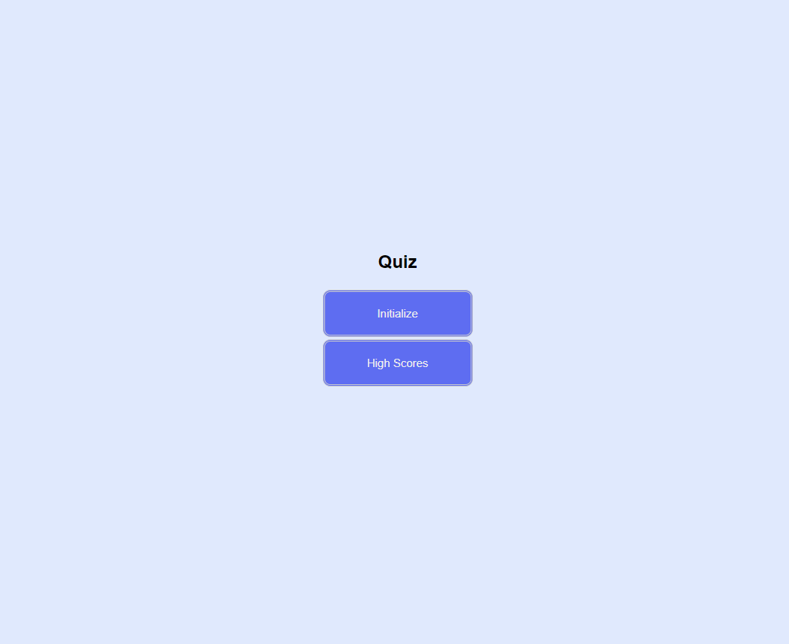

# 04 Quiz

## Description
* Click the Initialize button
* A timer starts and user is presented with a question
* If user answers a question correctly then the user is presented with another question
* Quiz concludes if all questions are answered or the timer reaches 0
* User can then can save the score tied to their initials

## Screenshot

## Link
[Quiz](https://73gs514.github.io/Quiz/)

